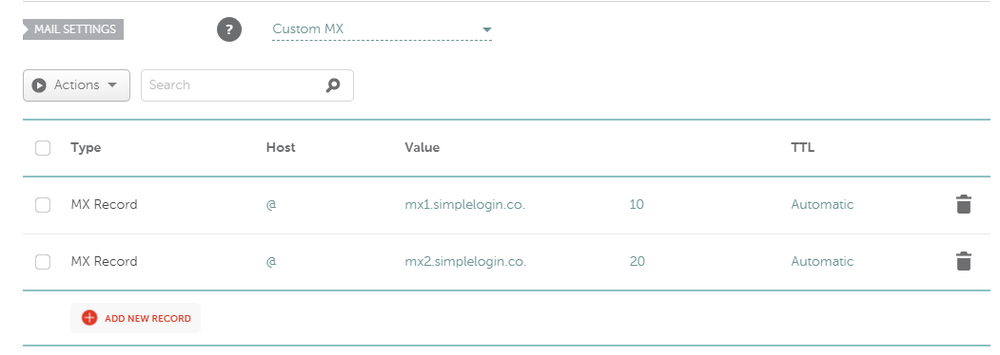

# Using Alias Email Addresses with SimpleLogin.io
## A guide to setting up alias email addresses for safety and privacy
written by [webdevterri](https://github.com/webdevterri)

###### Table of Contents: [Why should I be using so many email accounts?](#intro) | [Deciding on Your Main Email Account](#mainemail) | [Using SimpleLogin](#simplelogin) | [Buying Your Own Domain Name (Optional)](#owndomain) | [Pointing Your Domain Name to SimpleLogin](#setup) | [Using Directories for Wildcards and Creating Aliases on the Fly](#wildcardalias) | [Creating Aliases Using Your Own Domain Name](#alias) | [Links](#links)
---

### Why should I be using so many email accounts? 

You shouldn't. When I say email aliases, I don't mean creating multiple accounts somewhere like Gmail, Hotmail or Yahoo. I'm also not even talking about the alias options that some email service providers offer. You will understand the further you read.

Let me start by saying this: I'd rather a hacker have my password to a website than my email. A password on its own is nothing. But with an email, a lot can be found out. With the method below, a hacker will never be able to use your credentials from one site at another site.

Many people unfortunately use the same email and password combination across different websites. Their login credentials for, say, Amazon, Paypal and eBay might be the same (ie. same email and same password). If eBay had a data breach and your credentials were posted and sold on the dark web, the hacker could test your credentials on other sites and thus hack into your Paypal and Amazon accounts as well. What a mess!

Decompartmentalization is the key! If one of your accounts is breached, it should not affect any of your other accounts. If a hacker got a hold of your log in credentials to a website, with decompartmentalization they will only waster their time trying to use those credentials anywhere else.

### Deciding on Your Main Email Account 

You need to decide where you want to host your main private email address. I suggest a paid option. You know what they say, *'if it's free, you're the product!'*

If you disagree, you can stick to free options. But if you're serious about privacy and more security, I suggest a paid option. I personally settled on [Protonmail](https://protonmail.com).

So what do I mean by "main" or "private" email? This is the email where you will point all your alias email addresses. You will not be giving this email address to anyone, except on the very rare occasion.

For this guide, let's pretend your main email address is `mymainsecretemail@protonmail.com` hosted on [Protonmail](https://protonmail.com).

Sidenote: You may be wondering, why not just use the email I have right now as my main email account instead of creating a new account. Chances are your email has been used unwisely all over the internet by now. I suggest you check any and every email address you own on [HaveIBeenPwned](https://haveibeenpwned.com/) to see if your emails have been involved in any data breaches.

### Using SimpleLogin 

Sign up for an account at SimpleLogin.io with your main email account ( `mymainsecretemail@protonmail.com` ). This is one of the rare occasions you will be signing up for something with your main email account.

It's free to join, but we will be using the paid option for the features. I paid $15 for the first year. Subsequent years will cost $30 per year, which is well worth it.

### Buying Your Own Domain Name (Optional) 

This step is optional but highly recommended. If you opt out of buying your own domain name, you can also skip the next section about pointing the domain name to [SimpleLogin](https://simplelogin.io).

There are many places where you can buy a domain name. I highly recommend [Namecheap](https://namecheap.com). They have the best customer service of any company I've ever dealt with, their prices are fair, and they have frequent sales.

Another plus is that they now offer FREE WhoIs Privacy protection forever, meaning your name and contact information doesn't appear on the WhoIs record. Instead, the company's info shows up instead.

You should come up with a domain name that does not identify you. We're not setting up a brand here. This will be used for your account registrations, newsletter signups and the like. So `billyleesmith.com` is not a good idea. Find something that will not call attention to it or give a clue to who owns the domain. Our goal is to be anonymous. I believe something random (like `bd92s92n.com` ) or related to emails (like `mailbox987.com` ) is best.

For this guide, let's pretend you purchased `mailbox987.com`.

### Pointing Your Domain Name to SimpleLogin 

Follow these steps to point your new domain name to [SimpleLogin](https://simplelogin.io) to get your mail forwarding ready to use:

- Log on to [Namecheap](https://namecheap.com). On the left hand menu, go to your **Domain** list.
- Click **Manage**.
- Scroll down on the first screen to **Mail Settings**.
- Enter the information exactly the way you see it depicted below. Select **Custom MX** from the dropdown menu.
- You will make two records, both hosts will be set to `@`.
The first record will have the target (or value) of `mx1.simplelogin.co` with a priority of `10`.
- The second record will have the target/value of `mx2.simplelogin.co` and set the priority to `20`.

*Note: if you use a different domain registrar this may or may not work. Separate instructions are available on SimpleLogin.*

- Now head back to [SimpleLogin](https://simplelogin.io) and click on the **Domains** link on the top menu bar.
- Type in your new domain name. For this example, `mailbox987`.
- And for the default mailbox, enter your private/main email address where you want your mail forwarded to. In this example: `mymainsecretemail@protonmail.com`
- You will need to **verify** that your purchased domain has been properly configured. To do this, click on **Details** under the domain name.
- Then, click on the **DNS** link on the right hand menu.
- Under the first section, labeled **MX Records**, click the **Verify** button.
*Note: you may have to wait just a little while after setting up the MX Record on [Namecheap](https://namecheap.com). Also, if you scroll down, you will see MX records are not the only option to connect a domain. But using [Namecheap](https://namecheap.com), this is the way to go.*

Once verified, you're ready to start using your own domain name with email aliases!

### Using Directories for Wildcards and Creating Aliases on the Fly 

Currently, directories can not be used with your purchased domain name, but with the domains provided by [SimpleLogin](https://simplelogin.io).

Domains offered by [SimpleLogin](https://simplelogin.io) are:
- `aleeas.com`
- `slmail.me`
- `simplelogin.co`
- `simplelogin.fr`

You can set up directories in [SimpleLogin](https://simplelogin.io) to be used to make wildcard aliases on the fly with any of the domains listed above.

For example, I set up a **Directory** called `freelance`. There are three different ways to make a wildcard alias:
`freelance+aliasname@aleeas.com` or `freelance#aliasname@aleeas.com` or `freelance/aliasname@aleeas.com`

So:
`directory_name + [+, @ or /] + new_alias + @[one of the domains above]`

Note: The alias must be in lowercase.

These email aliases can be created on the fly! Let's say I wanted to sign up for a newsletter. Right there on the sign up form, I can type in `freelance+news2@simplelogin.co` and when they send an email to that alias, it gets created automagically!

And if you set everything up correctly, the emails will go to your main email account: `mymainsecretemail@protonmail.com` which no one will ever see because if you reply to an email, it shows as coming from that alias! It's really awesome.

#### Word of Caution about Directory Names

My suggestion is: if you are using directories, you may not want to use something like `shopping` or `work` (if they're even available) because someone else may try to make aliases on-the-fly using those words, maybe thinking it's one of their own directories and *you* will start receiving their emails.

So if you want a directory called `freelance` try something a little more customized like `freelance56`. Just add a little something extra to it. It'll be more likely that that domain is available and less likely someone might accidently create an alias on-the-fly using that directory name.

### Creating Aliases Using Your Own Domain Name 

So why buy the domain name? You can still make aliases on the fly with your domain name. That's the whole point. Plus, it's safer to use your domain as you know exactly what it's being used for, unlike the provided domains above. You have no idea what others are using it for and what if one of those domains gets blacklisted on a website that you use? Not good.

You can do the same thing with your own domain name. Let's pretend that you want to sign up for an account at Zillow.com. You don't have to go to [SimpleLogin](https://simplelogin.io) to do anything at this point. You can just make up and email right there on the sign up page, like so:
`zillow@mailbox987.com` ...or whatever you want to the alias to be. And when Zillow emails you, that email address will be created! It's that simple!

That's less likely to happen with your own domain name. You can check the history of your domain name using sites like [Norton Safe Web](https://safeweb.norton.com/) and [The Wayback Machine](https://web.archive.org/). There are other sites out there, some paid, some free.

If you're the first person to own that domain, you're lucky. You have a clean record!

----

Related Article: [Learn how to send an email as your alias](sendingemailsfromalias.md)

----
#### Links 

[Protonmail](https://protonmail.com)

[Mail.com](https://mail.com)

[SimpleLogin](https://simplelogin.io)

[Namecheap](https://namecheap.com)

[HaveIBeenPwned](https://haveibeenpwned.com/)

[Norton Safe Web](https://safeweb.norton.com/)

[The Wayback Machine](https://web.archive.org/)
