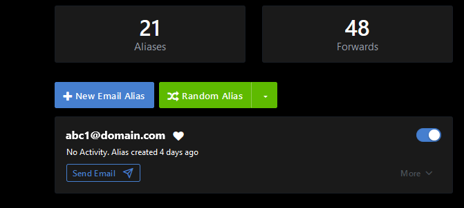
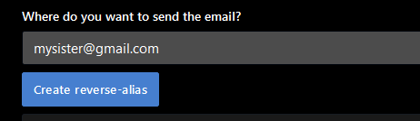
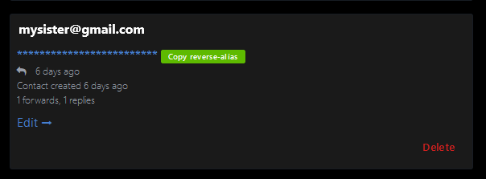
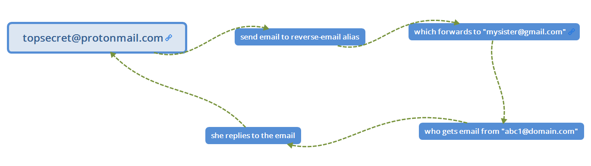

# How to Send Emails From Your Aliases

written by [webdevterri](https://github.com/webdevterri)

It's easy enough to respond to an email that you receive through one of your alias emails. (Just respond!) But what about if you want to email someone who hasn't emailed you? Here's how:

On the **Alias** page, find the alias you would like to send email from or create one. Click the **Send Email** button.

Now you will create a **reverse-alias**. Type in the name and/or email address of the person you want to contact appearing as this alias.

So let's pretend I want to send `mysister@gmail.com` an email appearing as `abc1@domain.com`. Do the following:

Fill in the textbox with the name and/or email address of who you want to email, and then click **Create reverse-alias** like so:

Now you can click **Copy reverse-alias**:

*It will be a long, strange looking email address. Don't ask me how it works. I don't know exactly. I just know that it does. It really works like a charm!*

You will then email this person from your main private email address, let's say `topsecret@protonmail.com`. You can also save this contact in your address book to reuse. They will only see your alias `abc1@domain.com`, not your private email address `topsecret@protonmail.com` !

This might seem counter-intuitive, as if you're sending email to yourself, but you're not. Doing this will send the email to who you want to send the email to and it will appear as if it's coming from your alias `abc1@domain.com`. The receiver will never see your main (private) email address!

#### Tip 1

If there are people you contact frequently or know you will be contacting, you can set up these (reverse-alias) emails in your main email provider's contact book, because there's no way you can memorize the long reverse addresses.

#### Tip 2

If you have a group of people you contact frequently, create an alias to use for them and create reverse-aliases for all of them to populate your contact list/address book in one setting. Get it done all at once while this is fresh in your mind and you're on a roll.

And remember, you can create aliases to contact different groups of people (family, friends, work) or one for each individual, which might be excessive in the case of family members.

Actually, if you have a family member or friend who you know to use your email address to invite you to things or give out to join sweepstakes and raffles without your permission, you may want to make a separate alias just for that person because you can turn off an alias.

To do so, click the toggle to the off/disabled position, in the top right corner of box containing that specific alias. You will stop receiving emails being send to that alias. You can turn it back on later.

----
### Video

You can watch this in action [here](https://youtu.be/VsypF-DBaow).
